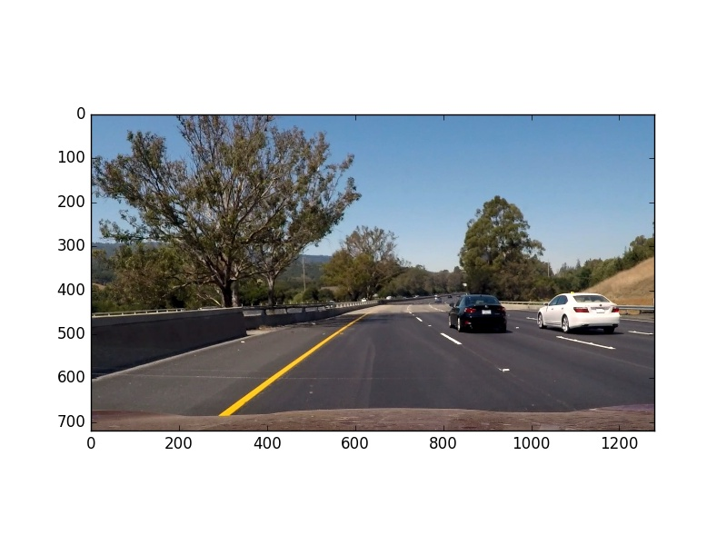

#Project 5: Vehicle Detection
##Overview 
The objective of this project is to use computer vision techniques to identify and track vehicles within a video sequence.

The main vehicle identification tool will be a machine learning classifier, trained to classify areas of each video frame using features extracted from those image areas.

##Training Data
Sample images were provided from two data sets (**GTI**, **KITTI**), split into sets for both positives (vehicles) and negatives (non-vehicles).

Vehicle images are typical car rear-view images, similar to the following:

Note that the resolution of these images is 64*64 pixels.

The non-vehicle images in the negative set are random sunsets of street views, similar to the following:

These images were extracted from the provided ZIP files and placed into two directories.  A function **read_file_list()** was created to use os.walk() to scan over these nested directories and return lists of positive and negative image file names (**vehicle_detection.py**, lines 33-47).

##Feature Extraction
To create a representation of each vehicle/non-vehicle, a vector of features must be created.  This feature vector will be the concatenation of three types of features: raw pixel intensity, a colour histogram, pixel gradients.

###Pixel Intensity
The raw pixel intensity is calculated simply by taking the raw pixels and creating a vector.  This is implemented in the **bin_spatial()** function using **ravel()** to create a vector from the image matrix (**vehicle_detection.py**, lines 55-59).  Note that the image is resized to 32*32 pixels - it would be possible to vary these dimensions, but this size appears to be effective.

###Colour Histogram
The colour histogram is created in the **color_hist()** function, which assigns pixels to a set number of bins over each of the 3 channels, then concatenates these 3 histograms to create a feature vector (**vehicle_detection.py**, lines 63-71).  Note that the range of values over which the bins are assignd will vary depending on the source of the image - PNG files read by matplotlib.image will have pixel values in the range (0,1), whilst JPG files read by cv2 will have pixel values in the range (0,256).  Throughout the project, pixels values will be normalised to (0,1) to avoid confusion.

###HOG Feature Extraction
The information about gradients within the image is calculated using a histogram of oriented gradients (HOG) process.  This by far the most complex element of the feature extraction process.

The HOG feature extraction is performed by the **skimage.feature.hog** function.  This function takes several parameters, such as the number of orientations, pixels per cell and cells per block, which are used to fine-tune the performance of the HOG algorithm.

HOG features can be visualised, as per the following examples (original car image, plus HOG features for each colour channel):

Note that the outline of the car is recognisible in the HOG features.

HOG features for non-car images have different characteristics:

This difference in characteristic layout of HOG features will allow the classifier to discriminate between sections of an image which contain a car and those which don't.

###Combining Feature Extractions
Following extraction of the 3 types of image features, the 3 vectors of features (spatial, colour, gradient/HOG) are concatenated to a single feature vector which will be used for classifier training.

The overall extraction of image features from a given image is implemented using the **single_image_features()** function (**vehicle_detection.py**, lines 110-162).  This function calls each feature extraction function in turn and returns the concatenated feature vector.  
When a list of images are presented for feature extraction, the **extract_features()** function (**vehicle_detection.py**, lines 166-187) is used to call **single_image_features()** on each image in turn (this avoids potential bugs if **extract_features()** is a separate implementation, as in the lectures).  

The algorithm also allows a colour space to be chosen for the feature extraction, as different colour spaces will provide different separations of features.

###HOG Feature Parameter Determination
The HOG algorithm has many input parameters and performance is sensitive to these choices.  A trial-and-error approach would be painful, so the approach was to take the concepts presented in the original HOG paper by Navneet Dalal (see references 1, 2) and combine this with a search over a set of potential combinations.

The Dalal paper suggested that the optimal value for the **orientations** parameter would be 9.  To keep the number of parameter combinations practical, the **pixels_per_cell** value was set to 8 and the **cells per block** value to 2.  

This leaves freedom to vary the colour space, size of spatial feature scaling, number of histogram bins and the number of colour channels used to extract HOG features.  (Note: the search of optimal parameters was done over the parameters for the entire feature extraction process, not just for HOG parameters.)

The search over the parameter space is implemented in the **vehicle_classifier_finding.py** program.  Results are stored in the **classifier_results.txt** file.  

The _best_ parameters were determined as HSV colour space, 32*32 spatial binning, 64 colour histogram bins, 9 HOG orientations (assumed), 8 pixels per cell (assumed), 2 cells per block (assumed) and to apply HOG across all 3 pixel channels.  This combination of features gave an accuracy of 0.994 on a validation set of images extracted from the training data.

However, as we will see later, the HSV colour space did not prove to be ideal when applied to the test video and was changed to YCrCb.  Although YCrCb gave an accuracy of 0.991 and should therefore has a measured performance which is slightly worse than HSV (all other parameters being held the same), in practice this was not the case.

(Note: the parameter search uses the classifier training process which is discussed in the next section.)

##Classifier Training
A linear suppor vector machine classifier was used, as implemented in **sklearn.svm**.  

Training of this classifier is done in **train_SVC()**, a function which takes lists of positive and negative examples, scales the feature values (using **sklearn.preprocessing.StandardScaler**) and returns the trained classifier object (**vehicle_detection.py**, lines 191-212).

20% of the training data is extracted as validation data to test the classifier - the training process returns an accuracy value for the classifier (this accuracy was used to rank parameter combinations, as discussed previously). 

To assist in implementation of the image pipeline, a **predict_SVC()** function is provided to return predicted values for a given list of feature vectors.  Also **save_classifier()** and **load_classifier()** functions are provided, to dump the classifier objects to a pickle file and retrieve those objects later.  

The classifier training is done in the **vehicles_test.py** program, which generates test images, acts as a unit test of key functionality and trains/saves the classifier for future use in the pipeline.  With classifier accuracy scores of 0.9, no further tuning of the classifier fit was required.

##Sliding Windows Implementation
The next step in the process is to extract sub-sets of a video frame to test for the presence of a car.  This is done by a sliding windows technique, to extract small windows within the image and to move each subsequent window across/down the image in a series of rows.

Not all of the image is useful for vehicle detection.

From the image above, it is clear that much of the top of the image can be ignored (sky), along with a small strip at the bottom (car bonnet). This gives a useful zone from y=350 to y=650 (approx.).  

The **slide_window()** function calculates a list of zones across and down an area of an image space (i.e. dimensions of an image), taking parameters for stop-start in x,y, a window size and an overlap (**vehicle_detection.py**, lines 240-273).  

Note that in the processing pipeline, several window sizes (128x128, 96x96, 64x64) will be used for sliding windows.  Each sliding window will be scaled to the appropriate size for the classifier (64*64), but the various sizes can be used to detect cars which are near and far in the field of view.

Plotting sliding window zones over an example image will look something like the following:

Note that this example shows a subset of small windows - in practice there will be windows of different sizes, with overlap etc.  In each of the 3 sizes mentioned above, each frame was set to overlap the previous frame by 75%, both horizontally and vertically.

The list of sliding windows can then be used to generate sections of the full frame, which can each be tested by the classifier to determine if that section contains a car.  If the classifier finds a car, that section of the image can be tagged as a potential vehicle detection.

##Test Prediction
The following shows a plot of positive detections on the image.

Note that several overlapping windows are showing positive predictions.

##False Positive Management
It is very likely that some predictions made by the classifier will be incorrect - either false negatives or false positives.  Because of the use of several overlapping windows, false negatives are less of an issue - assuming that the classifier is working well, occasional missed identifications will be covered by other overalapping windows.  However, if all detections are treated as correct, this will cause too many detections to be logged in the final result (in practice, this would cause the self-driving car to potentially react to the false positive).  

For example, see the following video which uses all detections: [False positives video](./submission/test_video_output_false_positives.mp4) 

To address this, a heat-map approach is used.  An empty image of the same size of the original is created and as each new positive zone is detected, pixels in the corresponding area of this heatmap image have their value increased.  The adding of "heat" to a zone is done in the **add_weighted_heat()** function (**vehicle_detection.py**, lines 316-319).

The heatmap will look something like the following:

Note that the brighter sections represent the areas with more 'heat' - i.e. more detections in that area - whilst the lower left area (a single false positive result) has less heat.

The heatmap can then be thresholded, to create a map of areas with many detections (more than a threshold value of overlapping detections).  This is done in **threshold_heatmap()** (**vehicle_detection.py**, lines 323-326).

The thresholded heat map then looks something like:

Note that the areas with low levels of detections have been removed.

Finally, the thresholded heatmap is used as input to the **scipy.ndimage.measurements.label** function, which produces a list of distinct features within the image and a bounding box around that feature.  This is implemented in **get_label_boxes()** (**vehicle_detection.py**, lines 331-348).

At this stage, bounded boxes have been created for a single image frame.

To provide a robust false-positive treatment, the image pipeline uses the most recent 10 frames to generate the heatmap and discards any areas which have a value below the threshold of 20.  This means that a zone will be drawn against any area which is detected as a car on average at least twice in each of the last 10 frames - unlikely for a false positive.  This process is implemented within the pipeline in the **vehicle_pipeline.py** program.

##Video Output
The **vehicle_pipeline.py** program brings together all of the above to process the sample videos and produce an output video which shows the tracking of vehicles within the field of view. 

[Short video](./submission/test_video_output.mp4) 

[Full video](./submission/project_video_output.mp4) 

Note: the videos include insets of the detections, full heatmap (last 10 frames) and thresholded heatmap (used for labelling).

##Reflections
The pipeline produces a good output on the example video, with fairly stable boxes and no apparent false positives in the final video.  Some issues and areas for improvement are listed below.

###HSV Issues
The initial classifier was trained using HSV as the colour space.  This followed the set of parameters which were determined to give the best accuracy score.  However, the HSV classifier appeared to struggle to identify the white car in the sample image.  Compare the following images - the first is the basic classification with HSV, the second with YCrCb.  Clearly using YCrCb the classifier is able to more regularly find the white car in the image (and with fewer false positives).

The following videos show these problems (false positives, struggling to detect the white car) - note that the algorithm was otherwise identical to the final version using YCrCb.
[HSV short video](./submission/test_video_output_HSV.mp4) 
[HSV full video](./submission/project_video_output_HSV.mp4) 

It is surprising that the classifier which performed best on the sample images has significant issues in the practical application. This may be either due to some over-fitting to the training data (i.e. is the training data truly representative of a real-world containing the example white car) or the algorithm may be very sensitive to the colour-space and separation of pixel values.

###Weaknesses in the Pipeline
The algorithm works well for the two example cars, but will only detect objects similar to those in the training data.  The training data appears to contain a wide variety of cars, but clearly there are other road-users and vehicle types which will need detection.  This would include trucks, vans, cars with trailers (U-Haul etc), motorbikes, pedal cycles - even the occasional horse and rider.

The pipeline also seems to lose tracking on the white car as that car gets further in front of the video car.  This is likely due to the size of the sliding windows being too large to get a good image of the car at distance and could be corrected by a sliding window size of, say, 32x32 or even 16x16.  The issues with small sliding windows are that there will be less information available and the number of windows for classification will get large, leading to a slower process.

###Areas for Improvement
The key area for improvement is in speed of the pipeline process. The video processing (on an i7-6820 with 16GB RAM and SSD - a fairly capable machine) took 4 hours in the final form, which is clearly not useful for real-time self-driving.  Whilst it isn't expected that this Python process would be fit for real-time computing, faster processing would be useful to make it a better test-bed.  Possibly this could be done by computing the HOG features in bulk (for the whole image) and then sub-sampling as required (this would need the HOG features to be invariant across the sliding windows, which I believe to be the case).

###Combination of Lane-Finding and Vehicle Detection
The creation of pipelines for image processing makes it straightforward to apply multiple pipelines to the same image stream - for example, the following video shows the application of both vehicle detection and lane finding to the same video stream.

[Combined Lane- and Vehicle-Finding](./submission/project_video_output_lanes_and_vehicles.mp4) 

##References
1) Original HOG paper, Navneet Dalal: http://lear.inrialpes.fr/people/triggs/pubs/Dalal-cvpr05.pdf
2) Youtube presentation, Navneet Dalal: https://www.youtube.com/watch?v=7S5qXET179I

Neil Maude, March 2017